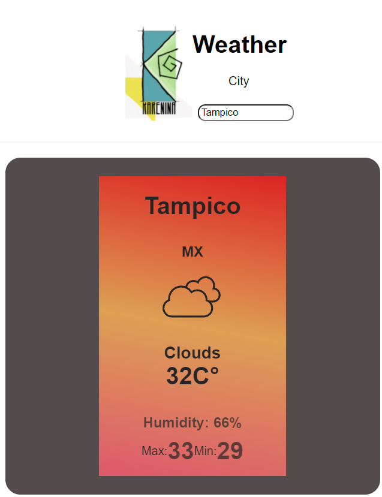

# Weather

Activity example learned in my Bootcamp journey where I learned how to fetch a Weather API implementing async/await syntax.
Weather, displays relevant data according to the city searched. For this version, some features are added, upgraded, or changed in order to keep learning and practice my tech stack.

## Upgraded features:

- Bootstrap library changed to CSS to create a new app styling.
- A temperature color logic implemented according to the real climate to display related colors.
- Responsive design.
- Icons in svg format are displayed according to the actual climate.

# Getting Started with Create React App

This project was bootstrapped with [Create React App](https://github.com/facebook/create-react-app).

## Available Scripts

In the project directory, you can run

to install all dependencies:

### `npm install`

to run the app in the development mode.\

### `npm start`

Open [http://localhost:3000](http://localhost:3000) to view it in the browser.

The page will reload if you make edits.\
You will also see any lint errors in the console.

#### Credits

icons - [@Mithun Raj](https://freeicons.io/profile/752)
